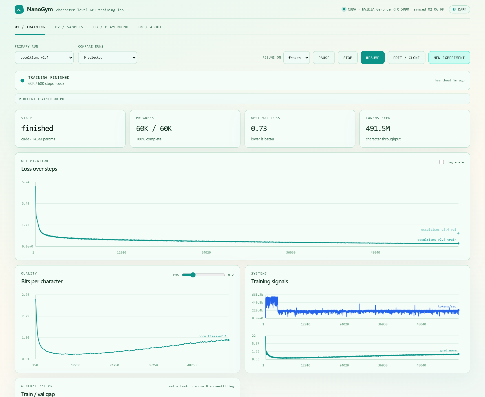
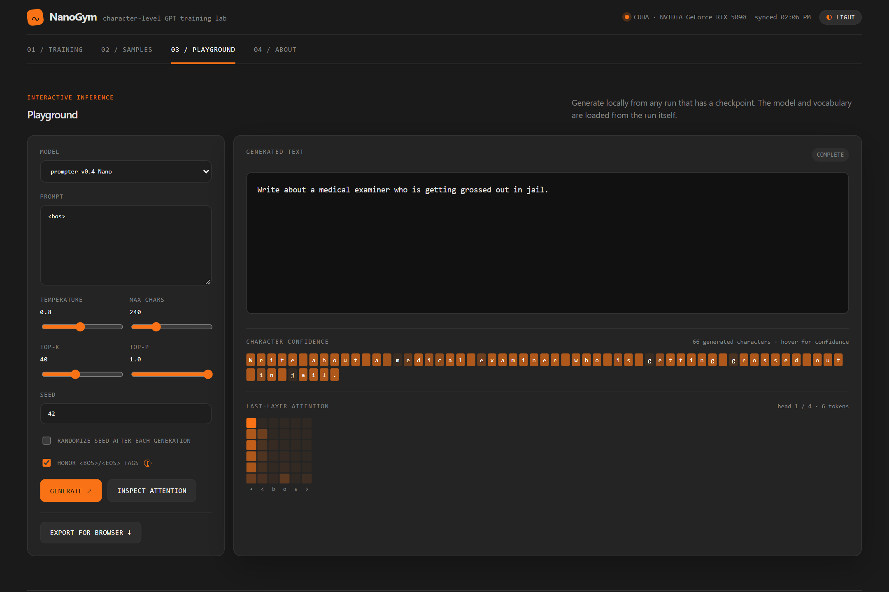
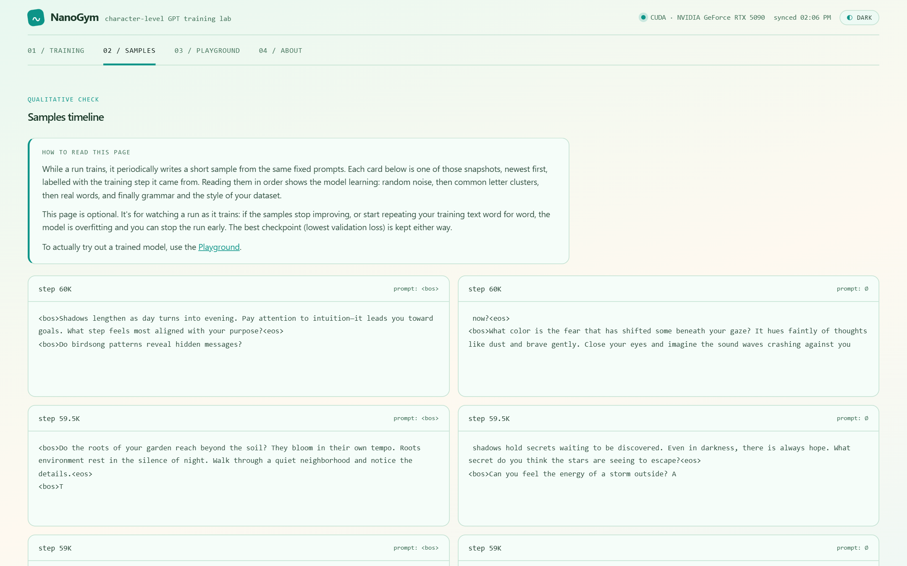
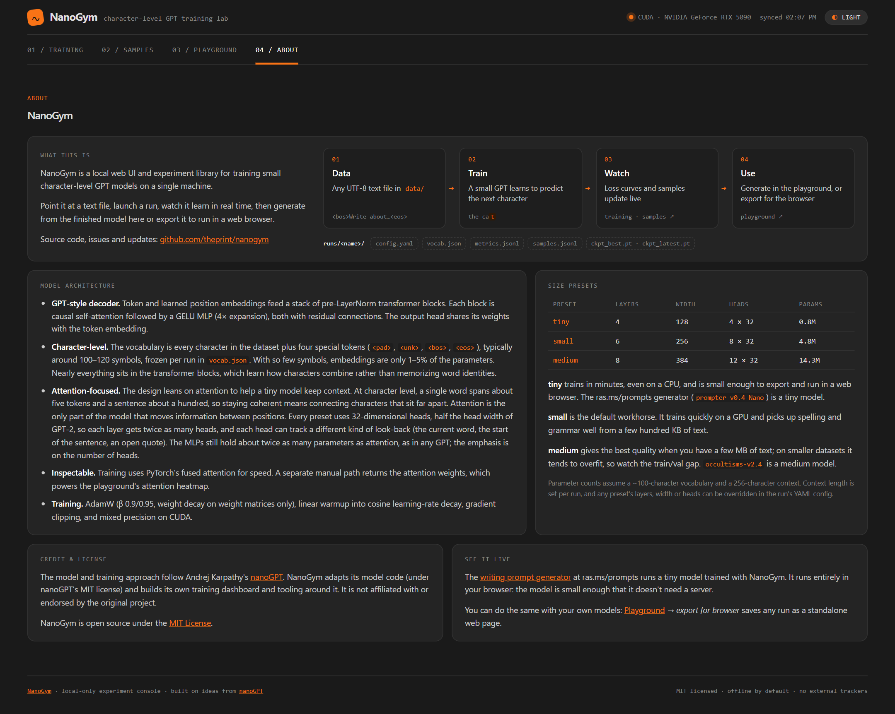

# NanoGym

**A local web UI and experiment library for training small character-level GPT
models.** Point it at a text file, launch a run, watch the model learn in real
time, then try it out or export it as a web page that runs the model entirely in
the browser.

NanoGym builds on Andrej Karpathy's [nanoGPT](https://github.com/karpathy/nanoGPT):
the model code is adapted from it (see [LICENSE](LICENSE)), and NanoGym adds the
training dashboard, experiment tracking and browser export around it. It is not
affiliated with or endorsed by the nanoGPT project.

> **See it live:** the writing-prompt generator at
> [ras.ms/prompts](https://ras.ms/prompts) runs a 0.8M-parameter model trained
> with NanoGym, entirely in your browser. Its source is in
> [`browser-prompt/`](browser-prompt/).



## Features

- **Training dashboard.** Launch, pause, resume and clone runs from the browser.
  Loss, bits per character, throughput, gradient norm and the train/val gap
  update live, and you can overlay runs to compare them.
- **Samples timeline.** See what the model writes at each checkpoint, from
  random noise to real words to the style of your dataset.
- **Playground.** Generate from any run with temperature, top-k and top-p, see
  per-character confidence, and inspect what the last attention layer looks at.
- **Browser export.** Turn any run into a self-contained static web page: a small
  JavaScript inference engine, the weights, a one-button test page, and a
  `training.json` describing how the model was trained.
- **Self-describing runs.** Every run keeps its frozen config, vocabulary,
  metrics, samples and checkpoints together in `runs/<name>/`.
- **Light and dark themes**, with tooltips on every control.

## Requirements

- Python 3.10 or newer (developed on 3.11)
- PyTorch 2.1 or newer. A GPU is optional: the `tiny` preset trains fine on a CPU,
  and NVIDIA (CUDA) and Apple Silicon (MPS) GPUs are used automatically when
  available.

## Setup

```bash
git clone https://github.com/theprint/nanogym.git
cd nanogym
python -m venv .venv
```

Activate the environment: `.venv\Scripts\activate` on Windows, or
`source .venv/bin/activate` on macOS and Linux.

**If you have an NVIDIA GPU**, install the CUDA build of PyTorch first. On
Windows, a plain `pip install torch` gets the CPU-only build. Pick the command
for your system at [pytorch.org](https://pytorch.org/get-started/locally/), for
example:

```bash
pip install torch --index-url https://download.pytorch.org/whl/cu128
```

Then install the rest:

```bash
pip install -r requirements.txt
```

## Start the dashboard

```bash
python scripts/serve.py --allow-control
```

Open <http://127.0.0.1:7669>. On Windows you can double-click
`start-server.bat` instead (and `stop-server.bat` to stop it).

`--allow-control` lets the dashboard start, stop and resume training runs on
your machine. Without it the dashboard is view-only (pausing still works). The
server only listens on your own machine (`127.0.0.1`) and rejects requests from
other websites.

## Try the bundled models

Two trained models ship with the repo, along with the datasets they were trained
on:

| Run | Preset | Parameters | Dataset | What it writes |
|---|---|---|---|---|
| `prompter-v0.4-Nano` | tiny | 0.8M | `writing_prompts.txt` (62 MB) | One-line creative writing prompts |
| `occultisms-v2.4` | medium | 14.3M | `occultisms_29k.txt` (4.7 MB) | Short reflective, mystical passages |

Pick either one in the **Training** tab to see its full training history, or open
the **Playground** and click **Generate**.



With **honor `<bos>`/`<eos>` tags** checked (the default), the prompt box starts
as `<bos>`. Leave it like that and click **Generate** to get one complete entry
from the seed alone, or type after `<bos>` to steer how the entry begins.
Hover over any setting for a short explanation.

The occultisms model is also a real-world example of overfitting: its validation
loss bottoms out around step 10,000 and climbs after that, which the
**Train / val gap** chart makes easy to see. Because the best checkpoint is
kept, the model you generate from is the one from the low point.

## Train your own model

1. **Add a dataset.** Put a UTF-8 `.txt` file in `data/`. If your data is a
   list of separate entries (prompts, quotes, poems…), wrap each one in `<bos>`
   and `<eos>` so the model learns where entries start and end. See
   [`data/README.md`](data/README.md).
2. **Launch a run.** In the **Training** tab, click **New experiment**, choose
   the dataset, a model size and a name, and click **Start training**. Or use
   **Edit / clone** to start from an existing run's settings.
3. **Watch it learn.** Loss curves update live, and the **Samples** tab shows
   what the model writes as it improves. If validation loss starts rising while
   training loss keeps falling, the model is overfitting and you can stop early.
4. **Use it.** Generate in the **Playground**, or click **Export for browser**
   to get a standalone web page.

### Model sizes

| Preset | Layers | Width | Heads | Parameters | Good for |
|---|---|---|---|---|---|
| `tiny` | 4 | 128 | 4 × 32 | 0.8M | CPU training, quick experiments, running in a browser |
| `small` | 6 | 256 | 8 × 32 | 4.8M | The default; a few hundred KB of text or more |
| `medium` | 8 | 384 | 12 × 32 | 14.3M | Best quality with a few MB of text or more |

Every preset uses small (32-dimensional) attention heads, so each layer gets
more heads for its size. That helps a character-level model keep track of
context. The **About** tab in the dashboard explains the architecture in more
detail.

## Command line

Everything the dashboard does is also available as a script. Run any of them
with `--help` for all options.

```bash
# Check a dataset before training (character coverage, size)
python scripts/prepare_data.py data/occultisms_29k.txt

# Train from a config file; press Ctrl+C once to checkpoint and pause
python scripts/train.py --config configs/tiny.yaml
python scripts/train.py --config configs/tiny.yaml --resume

# Generate from a trained run
python -m src.sample --run runs/prompter-v0.4-Nano --prompt "<bos>" --max_new_chars 200

# Export a run as a standalone browser page (writes exports/<run>/)
python scripts/export.py --run prompter-v0.4-Nano
```

`configs/default.yaml` lists every setting with its default value. Copy it,
change `model_name` and `data.path`, and train. The dashboard's tooltips explain
what the main settings do.

## Browser export

**Export for browser** in the Playground (or `scripts/export.py`) writes
`exports/<run>/` and downloads it as a zip:

| File | What it is |
|---|---|
| `index.html` | A deliberately plain test page: click **Generate** for one complete entry |
| `model.js` | The inference engine, in plain JavaScript with no dependencies |
| `weights.bin`, `model.json`, `vocab.json` | The model |
| `training.json` | Dataset, training settings and checkpoint stats |
| `README.md` | How to run and host it |

Serve the folder with any static web server (`python -m http.server`) or upload
it to any static host. Nothing runs server-side. The test page is meant as a
starting point: [`browser-prompt/`](browser-prompt/) shows a fully styled app
built on the same engine.

<details>
<summary>More screenshots</summary>





</details>

## Project layout

```text
configs/         example training configs (tiny / small / medium / documented default)
data/            datasets: put your .txt files here
runs/            one folder per training run (two sample runs included)
scripts/         command-line entry points: train, serve, export, prepare_data
server/          the dashboard's API (FastAPI) and web UI (plain HTML/CSS/JS)
src/             model, tokenizer, trainer, metrics, sampling and export
src/web_export/  the template copied into every browser export
browser-prompt/  the ras.ms/prompts app, an example custom front end
```

Your own runs and exports stay out of git (see `.gitignore`); only the two
sample runs are tracked.

## License

[MIT](LICENSE). The model code is adapted from
[nanoGPT](https://github.com/karpathy/nanoGPT) by Andrej Karpathy, also MIT
licensed; both notices are in the LICENSE file.
